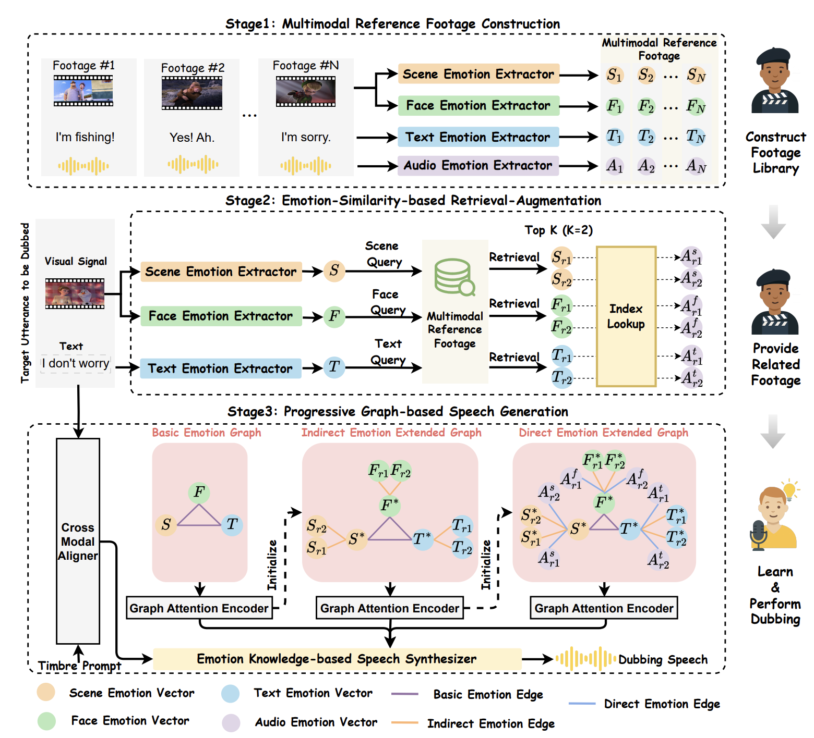

<div align="center">

<h1>🎬 Authentic-Dubber</h1>
<h3>Towards Authentic Movie Dubbing with Retrieve-Augmented <br> Director-Actor Interaction Learning</h3>

[Rui Liu](https://ttslr.github.io/people.html)<sup>1</sup>, Yuan Zhao<sup>1</sup>, Zhenqi Jia<sup>1</sup>

<sup>1</sup> [S2LAB](https://ttslr.github.io/)

*(Accepted by AAAI 2026)*

</div>

<div align="center" style="display: flex; justify-content: center; align-items: center;">
  <a href="https://arxiv.org/abs/2511.14249" style="margin: 0 2px;">
    
  </a>
  <a href='https://ai-s2-lab.github.io/Authentic-Dubber-Web/' style="margin: 0 2px;">
    
  </a>
  </div>

<br>

## :bookmark: Abstract

The automatic movie dubbing model generates vivid speech from given scripts, replicating a speaker's timbre from a brief timbre prompt while ensuring lip-sync with the silent video. Existing approaches simulate a simplified workflow where actors dub directly without preparation, overlooking the critical director-actor interaction. In contrast, authentic workflows involve a dynamic collaboration: directors actively engage with actors, guiding them to internalize the context cues, specifically emotion, before performance. To address this issue, we propose a new Retrieve-Augmented Director-Actor Interaction Learning scheme to achieve authentic movie dubbing, termed Authentic-Dubber, which contains three novel mechanisms: (1) We construct a multimodal Reference Footage library to simulate the learning footage provided by directors. Note that we integrate Large Language Models (LLMs) to achieve deep comprehension of emotional representations across multimodal signals. (2) To emulate how actors efficiently and comprehensively internalize director-provided footage during dubbing, we propose an Emotion-Similarity-based Retrieval-Augmentation strategy. This strategy retrieves the most relevant multimodal information that aligns with the target silent video. (3) We develop a Progressive Graph-based speech generation approach that incrementally incorporates the retrieved multimodal emotional knowledge, thereby simulating the actor's final dubbing process. The above mechanisms enable the Authentic-Dubber to faithfully replicate the authentic dubbing workflow, achieving comprehensive improvements in emotional expressiveness. Both subjective and objective evaluations on the V2C Animation benchmark dataset validate the effectiveness.


## :mag: Overview




## :boom: Updates


- **`2025-12-03`**: We released the training and inference scripts.
- **`2025-12-03`**: The [Speech Demo Page](https://ai-s2-lab.github.io/Authentic-Dubber-Web/) is now live.
- **`2025-11-18`**: 🎉 Our paper has been accepted by **AAAI 2026**!

## :checkered_flag: Installation

We recommend using Anaconda to manage the environment.

```bash
# Clone the repository
git clone https://github.com/YourUsername/Authentic-Dubber.git
cd Authentic-Dubber

# Create environment (Example)
conda create -n authentic_dubber python=3.9
conda activate authentic_dubber

# Install dependencies
pip install -r requirements.txt